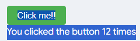

# my personal site
this is my basic personal site

this is kindov the first hackclub project i ever did, so dont blame me whoever reads this

i made this project as i am not really good at coding, so it was a mission with a guide and thats easier than making my own computer or something like that

# really cool feature-the mouse

## basicaly i saw online someone made one of these, so i added one in over here i basicaly copied.pasted from his repo but i think its OK as it ddnt work for ages and i had to fix like 5 times

# sections:

- Header obs
- about about me
- hobbies 
- school
- future
- js ()
- contact 
- Footer

(wow md is anoying)